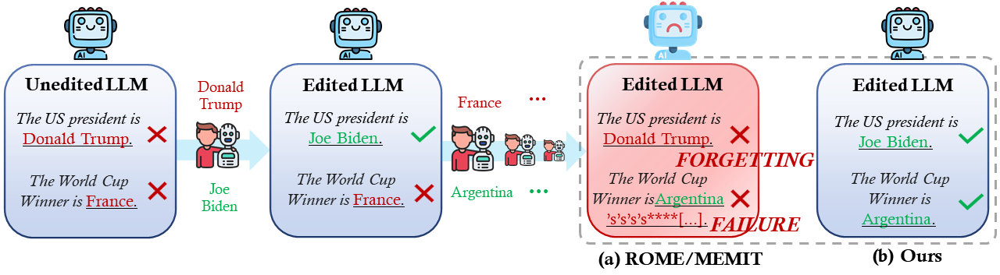
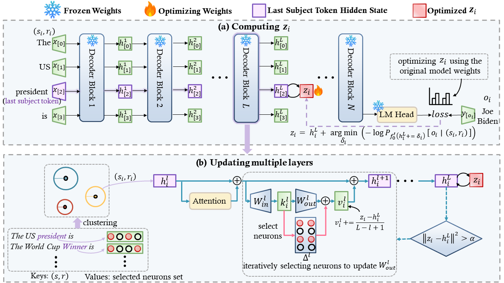

# NSE
- Code for [``Neuron-Level Sequential Editing in Pre-trained Transformers``]

This work introduces Neuron-level Sequential Editing (NSE), a new model editing method designed for sequential model editing in large language models. NSE prevents model failure by optimizing the hidden states of the target layer using the model's original weights. To mitigate model forgetting, it iteratively selects neurons in multiple layers based on their activation values. Empirical experiments show that NSE significantly outperforms existing parameter-modifying model editing methods in the context of sequential editing.

*Figure: This is the overall architecture of our NSE method.*

## Requirements
**At least one A40 48G GPU.**

- pytorch==1.12.1
- einops==0.4.0
- higher==0.2.1
- hydra-core==1.2.0
- transformers==4.23.1
- datasets==1.18.3
- matplotlib==3.6.1
- spacy==3.4.1
- scipy==1.9.2
- scikit-learn==1.0.2
- nltk==3.7

## Quick Start
### An example for editing GPT-J (6B) on counterfact dataset using NSE
#### 1. Edit GPT-J model 
 
    python3 -m experiments.evaluate --alg_name=NSE --model_name=EleutherAI/gpt-j-6B --hparams_fname=EleutherAI_gpt-j-6B.json --ds_name=mcf --dataset_size_limit=2000 --num_edits=100

This command runs an evaluation script for the NSE algorithm using the GPT-J-6B model from EleutherAI. Below are the explanations for each argument:

- `--alg_name=NSE`: Specifies the name of the algorithm being used, which is NSE in this case.
- `--model_name=EleutherAI_gpt-j-6B`: Indicates the name of the model being evaluated, here it is GPT-J-6B from EleutherAI.
- `--hparams_fname=EleutherAI_gpt-j-6B.json`: Points to the JSON file containing hyperparameters specific to the GPT-J-6B model.
- `--ds_name=mcf`: Specifies the dataset name, in this case, "mcf".
- `--dataset_size_limit=2000`: Sets the total number of editing samples to 2000.
- `--num_edits=100`: Defines the batch size for each round of editing, meaning 100 edits will be performed in each batch. Due to the clustering of samples within a batch in NSE, the size of `num_edits` should not be smaller than the value of `n_clusters` defined in the corresponding `hparams_fname` file.

#### 2. Summarize the results

    python summarize.py --dir_name=NSE --runs=run_<run1>,run_<run2>

## Acknowledgment
Our code is based on  [``MEMIT``](https://github.com/kmeng01/memit.git).
